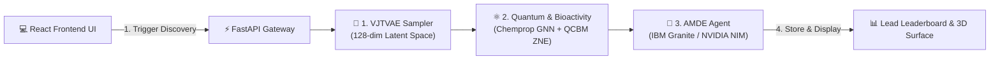

# NovaQure 🧬⚛️

### **Noise-Adaptive Hybrid AI–Quantum Framework for Targeted Oncology Drug Discovery**


NovaQure is a state-of-the-art hybrid AI–Quantum drug discovery platform engineered to accelerate targeted small-molecule discovery against cancer protein targets (specifically **EGFR Kinase** in non-small cell lung cancer).

Unlike legacy pipelines that rely solely on static generation or unverified scoring, NovaQure combines **Continuous VJTVAE Latent Space Sampling**, **Chemprop Graph Neural Network (MPNN) Bioactivity Prediction**, **Qiskit Zero-Noise Extrapolation (ZNE) Quantum Reliability Scoring**, and an **Autonomous AMDE LLM Reasoning Agent** powered by IBM Granite 4.1:3b and NVIDIA NIM Cloud APIs.

---

## 🎯 Research Motivation & Vision

Traditional drug discovery pipelines suffer from extensive molecular search spaces ($> 10^{60}$ potential structures), high laboratory synthesis costs, long optimization cycles (10+ years), and low candidate clinical success rates.

NovaQure addresses these challenges through a hybrid architecture designed to:
* **Accelerate Discovery Cycles**: Replace manual trial-and-error with 128-dimensional continuous latent space sampling.
* **Guarantee Syntactic Validity**: Utilize SELFIES representations to eliminate invalid chemical structures.
* **Mitigate NISQ Quantum Noise**: Apply Qiskit Zero-Noise Extrapolation (ZNE) to obtain reliable molecular ground-state energies under noisy quantum conditions.
* **Provide Explainable AI Guidance**: Employ an autonomous LLM reasoning agent (IBM Granite / NVIDIA NIM) to generate transparent, 1-sentence medicinal chemistry rationale for every lead candidate.

---

## 🌟 Core System Features & Innovations

### 1. 🧬 Generative Molecular Engine (VJTVAE + SELFIES)
* **128-Dimensional Continuous Latent Space**: Initialized from **10,833 ChEMBL EGFR bioactive compounds**.
* **100% Syntactic Chemical Validity**: Utilizes **SELFIES** (Self-Referencing Embedded Strings) rather than raw SMILES strings, guaranteeing zero broken rings or invalid valencies during sampling.

### 2. ⚛️ Multimodal Property & Quantum Reliability Engine (NQRE)
* **Chemprop MPNN Bioactivity Prediction**: Deep Graph Neural Network predicting binding affinity ($\text{pIC}_{50} = -\log_{10}(IC_{50})$).
* **Quantum Circuit Born Machine (QCBM)**: Simulates ground-state electronic energies of molecular scaffolds using Qiskit.
* **Zero-Noise Extrapolation (ZNE)**: Applies Richardson polynomial extrapolation across noise scaling factors ($\lambda \in \{1, 3, 5\}$) to eliminate quantum gate errors on NISQ-era hardware.

### 3. 🤖 Autonomous AMDE Agent & Dynamic IUPAC Matcher
* **Dual-LLM Reasoning Engine**: Supports local **IBM Granite 4.1:3b (Ollama)** and cloud-hosted **NVIDIA NIM APIs** (`meta/llama-3.2-11b-vision-instruct` / `nvidia/nemotron-4-340b-instruct`).
* **Self-Healing Fallback Architecture**: Automatically routes to a sub-second deterministic state machine if LLM endpoints time out or hit free-tier rate limits.
* **Dynamic IUPAC Nomenclature Engine**: Uses RDKit substructure hetero-ring matching to assign real-time IUPAC chemical descriptions (*4-Anilinoquinazoline Analog*, *Indolyl Bioactive Lead*, *Pyrimidine Core Scaffold*).

### 4. 🎨 Premium Browserbase UX & 3D WebGL Visualization
* **Paper-White Canvas & Ink-Black Pill CTAs**: Modern, high-contrast UI design system built with custom CSS variables.
* **Interactive 3D Electron Surface Renderer**: WebGL rendering via **3Dmol.js** supporting Stick, Sphere, and van der Waals Electron Cloud opacity rendering.
* **Pareto Frontier & 5-Axis Quality Profile**: Interactive scatter charts ($\text{pIC}_{50}$ vs QED) and candidate radar profiles displaying potency, synthesizability (SA score), and Lipinski compliance.
* **Live Execution Progress Tracker**: Real-time step-by-step progress tracking banner visualizing pipeline dataflows.

---

## 📐 System Architecture & Dataflow



---

## 🛠️ Technology Stack

| Layer | Technologies Used |
| :--- | :--- |
| **Frontend UI** | React 18, TypeScript, Vite, TanStack React Query v5, Recharts, 3Dmol.js, Axios |
| **Backend API** | Python 3.10+, FastAPI, Uvicorn, Pydantic v2, Python-Dotenv |
| **Machine Learning & AI** | PyTorch, Chemprop (MPNN), RDKit, SELFIES, Scikit-Learn |
| **Quantum Computing** | Qiskit 1.0+, PennyLane, Zero-Noise Extrapolation (ZNE) |
| **LLM & Agent Framework** | IBM Granite 4.1:3b (Ollama Local), NVIDIA NIM Cloud API, LangChain / ReAct |
| **Database & Auth** | SQLite, SQLAlchemy 2.0, Passlib (BCrypt), PyJWT |

---

## 🚀 Quickstart & Installation

### 1. Prerequisites
* **Python**: `3.10` or higher
* **Node.js**: `v18.0.0` or higher
* **Ollama** (Optional for local LLM mode): [Download Ollama](https://ollama.ai/)

### 2. Backend Setup
```bash
# Clone the repository
git clone https://github.com/Anuj-ipynb/NovaQure.git
cd NovaQure

# Create and activate Python virtual environment
# Windows (PowerShell):
python -m venv venv
.\venv\Scripts\Activate.ps1

# Linux / macOS:
python -m venv venv
source venv/bin/activate

# Install Python dependencies
pip install -r requirements.txt

# Start the FastAPI Uvicorn backend server
python -m uvicorn backend.main:app --port 8000 --reload
```
*Backend server will run live at `http://localhost:8000`. OpenAPI documentation available at `http://localhost:8000/docs`.*

### 3. Frontend Setup
Open a second terminal window:
```bash
cd NovaQure/frontend

# Install Node dependencies
npm install

# Launch Vite development server
npm run dev
```
*Frontend application will launch live at `http://localhost:5173`.*

---

## 🤖 Configuring LLM Decision Engines

NovaQure supports 3 decision engine modes accessible via the **`⚙️ Parameters`** drawer in Discovery Studio:

1. **IBM Granite 4.1:3b (Local Ollama)**:
   ```bash
   # Ensure Ollama is running and pull Granite model:
   ollama pull granite3.1-dense:8b
   ```
2. **NVIDIA NIM Cloud API**:
   Create a free account at [build.nvidia.com](https://build.nvidia.com/) and paste your API key in `.env`:
   ```env
   NVIDIA_API_KEY="nvapi-YourKeyHere"
   NVIDIA_MODEL="meta/llama-3.2-11b-vision-instruct"
   ```
3. **Deterministic Fallback Engine**:
   Default zero-cost sub-second execution engine requiring no external services.

---

## 📊 Core API Endpoints

| Method | Endpoint | Description |
| :--- | :--- | :--- |
| `GET` | `/api/v1/health` | System health check and status telemetry |
| `POST` | `/api/v1/auth/register` | Create new researcher account & issue JWT |
| `POST` | `/api/v1/auth/login` | Authenticate credentials & issue Bearer token |
| `GET` | `/api/v1/molecules` | Fetch screened lead candidate molecules |
| `GET` | `/api/v1/rankings` | Fetch Pareto-ranked lead candidate leaderboard |
| `POST` | `/api/v1/pipeline/run` | Execute closed-loop VJTVAE + QCBM + AMDE pipeline |
| `POST` | `/api/v1/config/llm` | Update active LLM provider (Ollama / NVIDIA / Fallback) |

---

## 🧪 Phase 3 & Future Scope

1. **In Vitro Biological Validation**:
   - Interfacing top-ranked lead candidates (`MCL-EGFR-001`) with automated CRO (Contract Research Organization) microfluidic kinase assays to measure real $IC_{50}$ biological ground truth.
2. **Active Learning Feedback Loop**:
   - Feeding wet-lab $IC_{50}$ assay results back into Chemprop MPNN weights to continuously fine-tune continuous latent space search.
3. **Multi-Protein Polypharmacology**:
   - Expanding target selection to **HER2**, **MET**, and **KRAS G12D** oncogenic mutations.

---

## 📜 License

Distributed under the **MIT License**. See `LICENSE` for more information.


